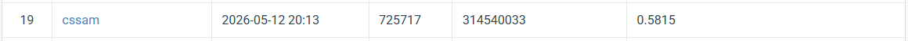

# NYCU Computer Vision 2026 HW3: Instance Segmentation
**Student ID:** 314540033

**Name:** Samuel Perez 培雷斯

## Introduction
This repository contains the training, evaluation, and inference pipeline for the VRDL Homework 3 Multi-Class Cell Instance Segmentation task. 

The core architecture utilizes a **Cascade Mask R-CNN** framework driven by a hierarchical **Swin-Small (Swin-S)** Vision Transformer backbone. To address the fundamental challenges of severe class imbalance, overlapping cell boundaries, and massive 16-bit TIFF image scales, the pipeline features a custom data normalization transform, an EDA-driven "Macro-Balanced" dataset split, heavy gradient checkpointing, and a mathematically corrected 4-channel Cross-Entropy mask head.

## Environment Setup (Critical)
Due to severe dependency conflicts often encountered in the OpenMMLab ecosystem (PyTorch vs. MMCV versioning, OpenCV channel limits, and NumPy C-ABI compilation errors), **do not install dependencies manually.** A highly personalized deployment script (`setup_env.sh`) has been engineered to automatically orchestrate a pristine, GPU-accelerated Conda environment (`mmdet_prod`) with synchronous syntax patches.

```bash
# Grant execution permissions to the script
chmod +x setup_env.sh

# Run the automated deployment pipeline
bash setup_env.sh

# Activate the securely built environment
conda activate mmdet_prod
```

## Repository Structure

* `setup_env.sh`: Automated Conda deployment and MMCV/NumPy dependency patcher.
* `configs/cascade_swin_small_refined_macro.py`: The finalized MMDetection configuration file defining the Swin-Small architecture, Cascade heads, and the CosineAnnealingLR schedule.
* `eda_prepare_coco.py`: Custom Exploratory Data Analysis (EDA) script that generates the "Macro-Balanced" 85/15 stratified train/val split to prevent minority-class (Class 3 & 4) starvation.
* `vrdl_dataset.py`: Contains the custom dataset pipeline and the critical `LoadTiffFromFile` transform (handles 16-bit to 8-bit normalization and RGB->BGR channel flipping).
* `train.py`: The main execution script for model training.
* `inference_clean.py` / `inference_tta.py`: Scripts for generating the final COCO-format JSON predictions for the CodaBench hidden test set.

## Data Preparation

Before training, you must process the raw TIFF masks and generate the macro-balanced COCO JSON annotations. Ensure the raw data is located in `./data/train/`.

```bash
# Generate train_coco.json and val_coco.json
python eda_prepare_coco.py

```
## Usage

### 1. Training

The model is trained using AdamW with differential learning rates (protecting the pre-trained Swin backbone) and a compressed 50-epoch Cosine schedule. Gradient checkpointing is enabled in the config to prevent OOM crashes on standard GPUs.

```bash
python train.py \
    --config configs/cascade_swin_small_refined_macro.py \
    --work-dir work_dirs/cascade_swin_small_refined_macro

```

### 2. Local Validation

To evaluate the local mAP on the validation set, the model relies on the strictly generated `share_val_coco.json`. The training script automatically evaluates this at designated epochs, but manual evaluation can be run via standard MMDetection testing tools against the `best_coco_segm_mAP_50_epoch_50.pth` checkpoint.

### 3. Inference

To reproduce the final CodaBench submission, execute the inference script. This script dynamically loads the test images from `./data/test_release/`, applies the appropriate transforms, and generates the required bounding box and RLE mask predictions.

```bash
# Generate the standard predictions for the test set
python inference_clean.py \
    --config configs/cascade_swin_small_refined_macro.py \
    --checkpoint work_dirs/cascade_swin_small_refined_macro/best_coco_segm_mAP_50_epoch_50.pth \
    --out test-results.json

```

*(Note: If utilizing Test-Time Augmentation (TTA), use `inference_tta.py` or `inference_tta_cpu.py` instead).*

## Performance Snapshot

* **Architecture:** Cascade Mask R-CNN + Swin-S
* **Best Local Validation AP50:** 0.7290 (Epoch 50)
* **Final CodaBench Private Score:** **0.5815**


